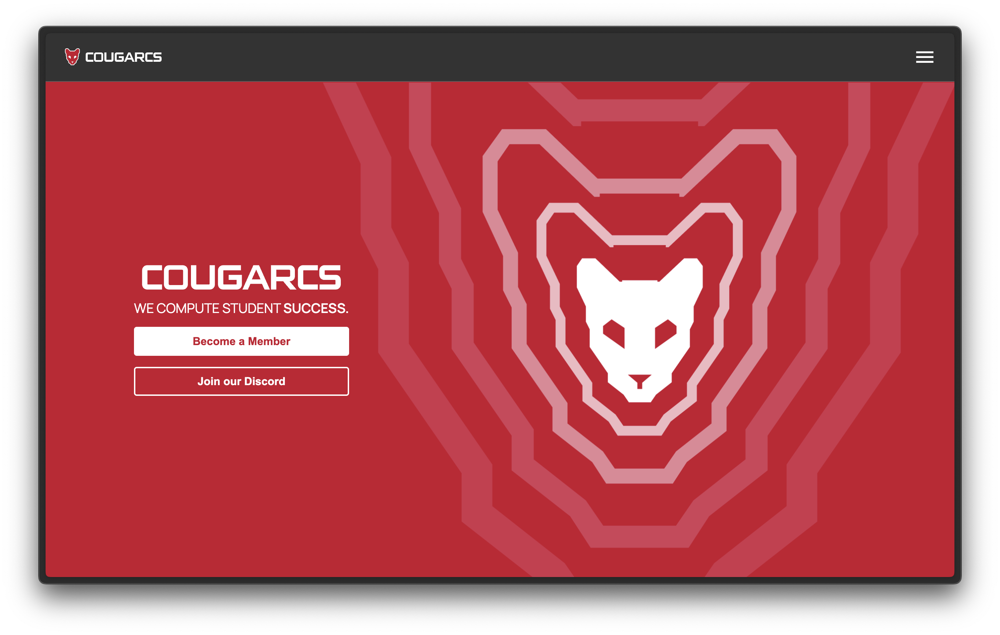

# CougarCS-Home

> CougarCS is the largest student-run Computer Science organization at the University of Houston. At CougarCS, our mission is to smoothly transition our inexperienced members into young professionals by the end of their degree and to provide support and assistance to members who struggle academically or who need career guidance.

The new homepage for cougarcs.com :)



Built using [Astro](https://astro.build/) + native, standards-based CSS (and sometimes CSS modules) for future maintainability (relying too heavily on Tailwind was hurting development efforts)

React is used sparingly for more interactive portions.

Made to (as closely as reasonably possible) match the [Figma design](https://www.figma.com/design/s2fUgiFpoXGBSOX5feNLhQ/Website-Re-design---CougarCS?node-id=59-69&t=rHa4uCF3jIwNY47A-1)

## NOTE:

This isn't deployed yet. In the coming days it'll be deployed on a subdomain on cougarcs.com, and then eventually the main site will migrate over to it.

## Run this locally!

We use [Astro](https://astro.build/) as our framework so the code is close to web-native, clean, and easy to build upon in the future. To try the site out on your machine:

1. Clone the repository:

   ```sh
   git clone git@github.com:CougarCS/CougarCS-Home.git
   ```
   or
   
   ```sh
   git clone https://github.com/yourusername/CougarCS-Home.git
   ```

3. Navigate to the project directory:

   ```sh
   cd CougarCS-Home
   ```

4. Install the dependencies [(we try to have very few!)](https://github.com/CougarCS/CougarCS-Home/blob/main/package.json):

   ```sh
   npm install
   ```

5. Start the dev server:

   ```sh
   npx astro dev
   ```

6. Your terminal should tell you the URL the dev site is active on.
   > this should be http://localhost:4321/
